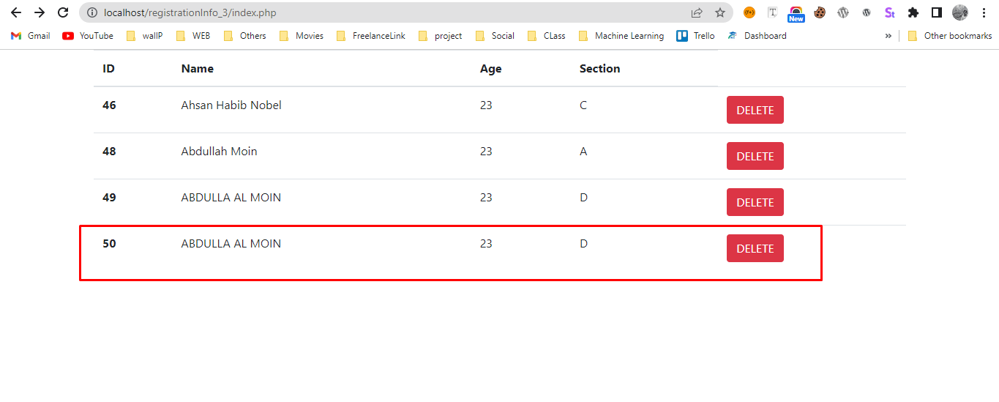
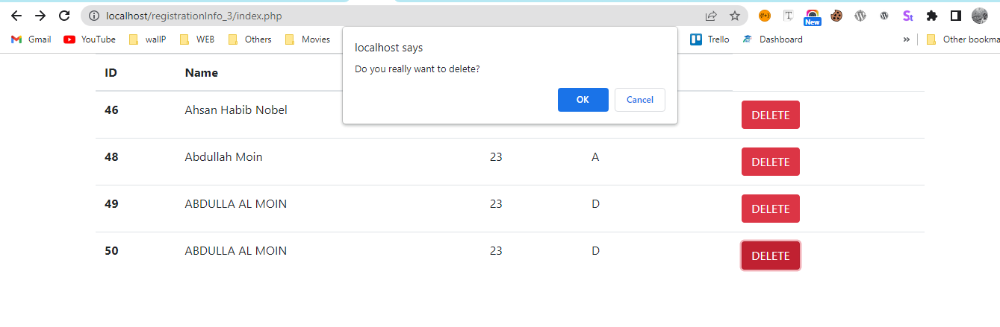
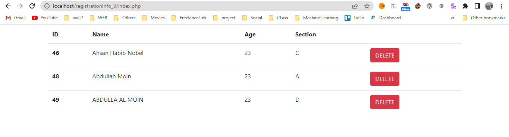
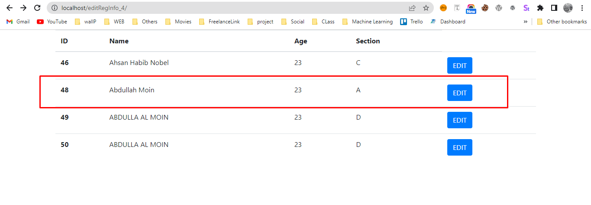
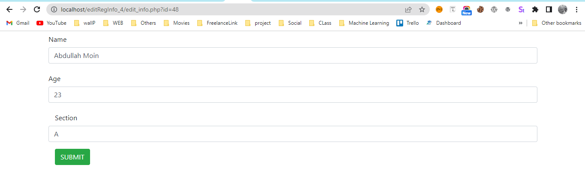
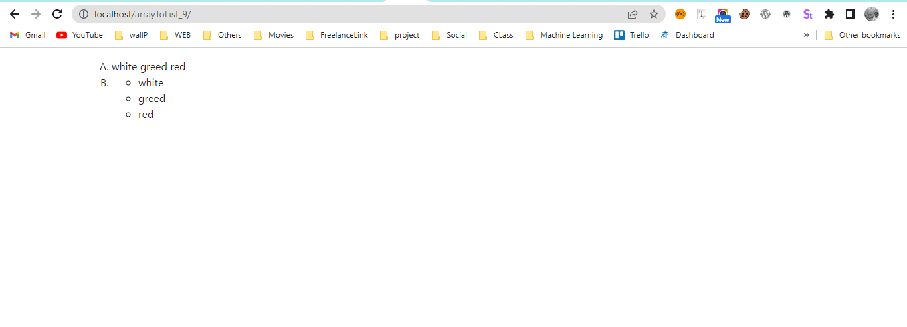

# LAB-FINAL-CSE415

Name: Abdulla Al Moin
Id: 192-15-2838
Section: PC-B

## Question 3
<pre>3. Write a PHP program to see user registration info from the database and delete a user individually. </pre>

- 
- 
- 

## Question 4
<pre>4. Write a PHP program to see user registration info from the database and edit a user individually. </pre>

- 
- 

## Question 9
<pre>9. $color = array('white', 'green', 'red'')
       Write a PHP script which will display the colors in the following way: 
       Output: 
          A. white, green, red
          B.
- green
- red
- white
</pre>
- 
